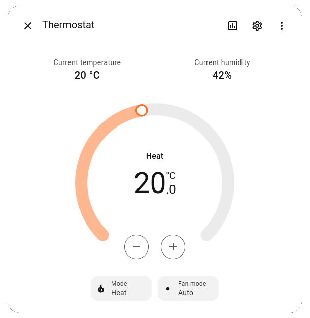

# Creamy Waha

<p align="center">
    
    <p align="center">The creamiest integration for using Watts Home Tekmar 564 from within HomeAssistant</p>
    <p align="center">
        <a href="https://github.com/AlbinoDrought/creamy-waha/blob/master/LICENSE"></a>
    </p>
</p>

Creamy Waha bridges the Watts Home API to MQTT. 

Data is transmitted in fashion that allows the Home Assistant MQTT integration to autodiscover your Tekmar 564 devices:

<p align="center">
<picture>
<source media="(prefers-color-scheme: dark)" srcset="./.readme/ha-thermostat-dark-nobg.png">

</picture>
</p>

This is not intended for production use. This application is unlikely to function correctly.

The project may not be hosted at this URL forever. 
If you use it in your home, please fork the repository or keep a local copy so you can rebuild it or modify it in the future as needed.

The supported features:

- Login
- Token refresh
- Devices:
  - Tekmar 564:
    - Show current temperature and humidity
    - Show current mode: heat, cool, heat/cool, emergency heat, off
    - Show current action: heating, cooling, idle, off
    - Show fan state: auto, on, schedule
    - Accept MQTT commands to change temperature setpoint
    - Accept MQTT commands to change current mode
    - Accept MQTT commands to change fan state

Configuration:

| Env Var          | Description                                          | Default                                |
|------------------|------------------------------------------------------|----------------------------------------|
| WAHA_USER        | Username to login with                               | No default. This variable is required. |
| WAHA_PASS        | Password to login with                               | No default. This variable is required. |
| WAHA_TOKENS_PATH | Writeable file path to save access/refresh tokens to | `tokens.json`                          |
| WAHA_MQTT_BROKER | URI of MQTT broker                                   | `tcp://localhost:1883`                 |
| WAHA_MQTT_USER   | Username for MQTT broker if required                 | Empty                                  |
| WAHA_MQTT_PASS   | Password for MQTT broker if required                 | Empty                                  |

Running with Docker Compose:

```yml
services:
  creamy-waha:
    image: ghcr.io/albinodrought/creamy-waha
    restart: unless-stopped
    environment:
      - WAHA_USER=my@email.example
      - WAHA_PASS=correct-horse-battery-staple
      - WAHA_TOKENS_PATH=/data/tokens.json
      - WAHA_MQTT_BROKER=tcp://your-mqtt-broker.example:1833
      - WAHA_MQTT_USER=your-mqtt-user
      - WAHA_MQTT_PASS=your-mqtt-pass
    volumes:
      - ./data:/data
```

Here are some other examples:

<details><summary>Running with Docker CLI only</summary>

```sh
docker run -d \
    --name creamy-waha \
    --restart unless-stopped \
    -e WAHA_USER=my@email.example \
    -e WAHA_PASS=correct-horse-battery-staple \
    -e WAHA_TOKENS_PATH=/data/tokens.json \
    -e WAHA_MQTT_BROKER=tcp://your-mqtt-broker.example:1833 \
    -e WAHA_MQTT_USER=your-mqtt-user \
    -e WAHA_MQTT_PASS=your-mqtt-pass \
    -v ./data:/data \
    ghcr.io/albinodrought/creamy-waha
```

</details>

<details><summary>Complete sample Docker Compose stack with Home Assistant and MQTT broker</summary>

```yml
services:
  home-assistant:
    container_name: home-assistant
    image: homeassistant/home-assistant:stable
    restart: unless-stopped
    labels:
      - 'creamin.enable=true'
      - 'creamin.host=home-assistant.your-lan.example'
      - 'creamin.port=8123'
    volumes:
      - ./configuration.yaml:/config/configuration.yaml:ro
      - ./ha-writeable:/config

  mqtt:
    container_name: mqtt
    image: eclipse-mosquitto:2.1.2-alpine
    restart: unless-stopped

  creamy-waha:
    image: ghcr.io/albinodrought/creamy-waha
    restart: unless-stopped
    env_file:
      - secrets-hvac.env
      # WAHA_USER
      # WAHA_PASS
    environment:
      - WAHA_MQTT_BROKER=tcp://mqtt:1883
      - WAHA_TOKENS_PATH=/data/tokens.json
    volumes:
      - ./waha:/data
```

</details>
